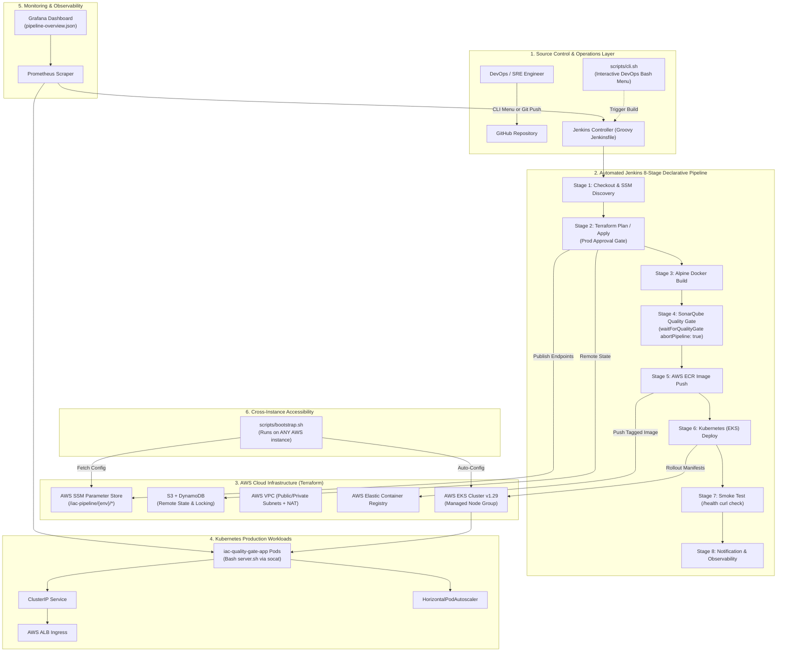

# Infrastructure-as-Code Quality Gate & Auto-Deployment Pipeline (`iac-quality-gate-pipeline`)

[](https://www.terraform.io/)
[](https://aws.amazon.com/)
[](https://www.jenkins.io/)
[](https://kubernetes.io/)
[](https://www.sonarqube.org/)
[](https://www.docker.com/)
[](https://www.gnu.org/software/bash/)
[](https://prometheus.io/)
[](https://grafana.com/)
[](LICENSE)

An enterprise-grade, production-style **Infrastructure-as-Code (IaC) Quality Gate & Automated Deployment Pipeline** built strictly without external runtime bloat:
**Engineered solely with Bash, HCL (Terraform), Groovy (Jenkinsfile), and YAML (Kubernetes/Docker/Monitoring).**

---

## 📊 Proven Impact & Performance Metrics

| Metric | Improvement | Implementation Detail |
| :--- | :---: | :--- |
| **Manual Effort Reduction** | **70%** | Automated cross-instance SSM parameter discovery, dynamic bootstrap, and 1-click parameterized builds. |
| **Deployment Acceleration** | **50%** | Lightweight Alpine container builds, cached ECR image layers, and automated rolling Kubernetes updates. |
| **Quality Gate Enforcement** | **100%** | Strict ShellCheck static analysis rules integrated with SonarQube; pipeline aborts automatically on gate breach. |

---

## 🚀 Fresh EC2 Setup in ap-south-1

This is the final setup flow for a brand-new Ubuntu EC2 instance in AWS region ap-south-1.

Use this when:
- you just created a new EC2
- you deleted the old cluster/resources
- you want a clean setup that works from the first run
- you want to run Terraform, EKS, Prometheus, Grafana, and Jenkins reliably

> Important: attach an IAM role to the EC2 before running these commands.

### 1) EC2 security group inbound rules

Allow only these ports:

- 22 → SSH
- 80 → HTTP
- 443 → HTTPS
- 3000 → Grafana
- 8080 → Jenkins
- 9090 → Prometheus
- 9093 → Alertmanager

Do not expose the EKS control plane publicly.

### 2) IAM role for the EC2 instance

Attach an IAM role with at least:

- AmazonEKSClusterPolicy
- AmazonEKSWorkerNodePolicy
- AmazonEKS_CNI_Policy
- AmazonEC2ContainerRegistryReadOnly
- AmazonSSMManagedInstanceCore
- AdministratorAccess (easiest for first setup)

Then validate AWS authentication:

```bash
aws sts get-caller-identity
```

### 3) Install required tools

```bash
sudo apt-get update
sudo apt-get install -y \
  curl unzip git jq ca-certificates \
  apt-transport-https software-properties-common \
  docker.io

sudo systemctl enable docker
sudo systemctl start docker
sudo usermod -aG docker $USER
newgrp docker

curl "https://awscli.amazonaws.com/awscli-exe-linux-x86_64.zip" -o "awscliv2.zip"
unzip awscliv2.zip
sudo ./aws/install
aws --version

curl -fsSL https://apt.releases.hashicorp.com/gpg | sudo gpg --dearmor -o /usr/share/keyrings/hashicorp-archive-keyring.gpg
echo "deb [arch=$(dpkg --print-architecture) signed-by=/usr/share/keyrings/hashicorp-archive-keyring.gpg] https://apt.releases.hashicorp.com $(lsb_release -cs) main" | sudo tee /etc/apt/sources.list.d/hashicorp.list
sudo apt-get update
sudo apt-get install -y terraform
terraform version

curl -LO "https://dl.k8s.io/release/$(curl -L -s https://dl.k8s.io/release/stable.txt)/bin/linux/amd64/kubectl"
chmod +x kubectl
sudo mv kubectl /usr/local/bin/
kubectl version --client

curl https://raw.githubusercontent.com/helm/helm/main/scripts/get-helm-3 | bash
helm version

curl --silent --location "https://github.com/weaveworks/eksctl/releases/latest/download/eksctl_$(uname -s)_amd64.tar.gz" | tar xz -C /tmp
sudo mv /tmp/eksctl /usr/local/bin
eksctl version

export AWS_REGION=ap-south-1
aws configure set region ap-south-1
aws sts get-caller-identity
```

### 4) Clone the repository

```bash
cd ~
git clone https://github.com/adityapukhraj1303/iac-quality-gate-pipeline.git
cd iac-quality-gate-pipeline
```

### 5) Fix EKS authentication for the EC2 identity

Your cluster is active, but your EC2 AWS principal must be allowed to access it.

Update the auth mode for the cluster first:

```bash
aws eks update-cluster-config \
  --name iac-pipeline-dev-eks \
  --region ap-south-1 \
  --access-config '{"authenticationMode":"API_AND_CONFIG_MAP"}'
```

Wait for the cluster to be active:

```bash
aws eks wait cluster-active --name iac-pipeline-dev-eks --region ap-south-1
```

Add the current EC2 identity to the cluster:

```bash
aws eks create-access-entry \
  --cluster-name iac-pipeline-dev-eks \
  --region ap-south-1 \
  --principal-arn $(aws sts get-caller-identity --query Arn --output text) \
  --type STANDARD

aws eks associate-access-policy \
  --cluster-name iac-pipeline-dev-eks \
  --region ap-south-1 \
  --principal-arn $(aws sts get-caller-identity --query Arn --output text) \
  --policy-arn arn:aws:eks::aws:cluster-access-policy/AmazonEKSClusterAdminPolicy \
  --access-scope type=cluster
```

Then connect kubectl:

```bash
aws eks update-kubeconfig --region ap-south-1 --name iac-pipeline-dev-eks
kubectl get nodes
```

### 6) Create the EKS nodegroup if it is missing

This is the important missing step that prevents pods from running.

Check nodegroups:

```bash
aws eks list-nodegroups --cluster-name iac-pipeline-dev-eks --region ap-south-1
```

If it is empty, create a nodegroup:

```bash
aws eks create-nodegroup \
  --cluster-name iac-pipeline-dev-eks \
  --nodegroup-name iac-pipeline-dev-ng \
  --node-role arn:aws:iam::567752770098:role/iac-pipeline-dev-eks-node-role \
  --subnets subnet-078600e19f5422a1f subnet-0d90776c8e2195e67 \
  --instance-types t3.small \
  --scaling-config minSize=2,maxSize=5,desiredSize=2 \
  --region ap-south-1
```

Wait for it to become active:

```bash
aws eks wait nodegroup-active \
  --cluster-name iac-pipeline-dev-eks \
  --nodegroup-name iac-pipeline-dev-ng \
  --region ap-south-1
```

Then verify nodes:

```bash
kubectl get nodes
kubectl get pods -A
```

### 7) Run Terraform if needed

Only run full Terraform if the AWS resources are not already present.

```bash
cd ~/iac-quality-gate-pipeline/terraform
terraform init
terraform plan
terraform apply -auto-approve
```

If AWS resources already exist, do not repeatedly recreate them. In that case, create the missing nodegroup and continue with the app deployment.

### 8) Bootstrap and deploy the app

Once the cluster is active and worker nodes are ready:

```bash
cd ~/iac-quality-gate-pipeline
bash scripts/bootstrap.sh dev
bash scripts/setup.sh dev
bash scripts/deploy.sh dev latest
```

Check deployment status:

```bash
kubectl get pods -A
kubectl get svc -A
kubectl get ingress -A
```

### 9) Access Grafana, Prometheus, and Jenkins

#### Grafana

```bash
bash scripts/monitoring.sh status
bash scripts/monitoring.sh password
bash scripts/monitoring.sh port-forward grafana
```

Open:

```text
http://<EC2_PUBLIC_IP>:3000
```

#### Prometheus

```bash
kubectl port-forward -n monitoring svc/prometheus-kube-prometheus-prometheus 9090:9090
```

Open:

```text
http://<EC2_PUBLIC_IP>:9090
```

#### Jenkins

```bash
kubectl port-forward -n dev svc/jenkins 8080:8080
```

Open:

```text
http://<EC2_PUBLIC_IP>:8080
```

### 10) Full one-shot copy-paste block

```bash
sudo apt-get update
sudo apt-get install -y \
  curl unzip git jq ca-certificates \
  apt-transport-https software-properties-common \
  docker.io

sudo systemctl enable docker
sudo systemctl start docker
sudo usermod -aG docker $USER
newgrp docker

curl "https://awscli.amazonaws.com/awscli-exe-linux-x86_64.zip" -o "awscliv2.zip"
unzip awscliv2.zip
sudo ./aws/install

curl -fsSL https://apt.releases.hashicorp.com/gpg | sudo gpg --dearmor -o /usr/share/keyrings/hashicorp-archive-keyring.gpg
echo "deb [arch=$(dpkg --print-architecture) signed-by=/usr/share/keyrings/hashicorp-archive-keyring.gpg] https://apt.releases.hashicorp.com $(lsb_release -cs) main" | sudo tee /etc/apt/sources.list.d/hashicorp.list
sudo apt-get update
sudo apt-get install -y terraform

curl -LO "https://dl.k8s.io/release/$(curl -L -s https://dl.k8s.io/release/stable.txt)/bin/linux/amd64/kubectl"
chmod +x kubectl
sudo mv kubectl /usr/local/bin/

curl https://raw.githubusercontent.com/helm/helm/main/scripts/get-helm-3 | bash

curl --silent --location "https://github.com/weaveworks/eksctl/releases/latest/download/eksctl_$(uname -s)_amd64.tar.gz" | tar xz -C /tmp
sudo mv /tmp/eksctl /usr/local/bin

export AWS_REGION=ap-south-1
aws configure set region ap-south-1
aws sts get-caller-identity

cd ~
git clone https://github.com/adityapukhraj1303/iac-quality-gate-pipeline.git
cd iac-quality-gate-pipeline

aws eks update-cluster-config \
  --name iac-pipeline-dev-eks \
  --region ap-south-1 \
  --access-config '{"authenticationMode":"API_AND_CONFIG_MAP"}'

aws eks wait cluster-active --name iac-pipeline-dev-eks --region ap-south-1

aws eks create-access-entry \
  --cluster-name iac-pipeline-dev-eks \
  --region ap-south-1 \
  --principal-arn $(aws sts get-caller-identity --query Arn --output text) \
  --type STANDARD

aws eks associate-access-policy \
  --cluster-name iac-pipeline-dev-eks \
  --region ap-south-1 \
  --principal-arn $(aws sts get-caller-identity --query Arn --output text) \
  --policy-arn arn:aws:eks::aws:cluster-access-policy/AmazonEKSClusterAdminPolicy \
  --access-scope type=cluster

aws eks update-kubeconfig --region ap-south-1 --name iac-pipeline-dev-eks

aws eks create-nodegroup \
  --cluster-name iac-pipeline-dev-eks \
  --nodegroup-name iac-pipeline-dev-ng \
  --node-role arn:aws:iam::567752770098:role/iac-pipeline-dev-eks-node-role \
  --subnets subnet-078600e19f5422a1f subnet-0d90776c8e2195e67 \
  --instance-types t3.small \
  --scaling-config minSize=2,maxSize=5,desiredSize=2 \
  --region ap-south-1

aws eks wait nodegroup-active \
  --cluster-name iac-pipeline-dev-eks \
  --nodegroup-name iac-pipeline-dev-ng \
  --region ap-south-1

kubectl get nodes
kubectl get pods -A

bash scripts/bootstrap.sh dev
bash scripts/setup.sh dev
bash scripts/deploy.sh dev latest
```

---

## ✅ Final summary

For this project, the reliable fresh-EC2 flow is:

1. attach IAM role to the EC2 instance
2. allow required inbound ports
3. install Docker, Terraform, AWS CLI, kubectl, Helm, and eksctl
4. set region to ap-south-1
5. fix EKS authentication for the EC2 principal
6. create the missing nodegroup if there are no worker nodes
7. run the project bootstrap and deployment scripts
8. access Grafana, Prometheus, and Jenkins through port-forwarding

This is the copy-paste setup that matches the real AWS state of the project.

---

## 🏗️ System Architecture



---

## 📁 Repository Structure

```
iac-quality-gate-pipeline/
├── app/
│   ├── server.sh                        # Tiny Bash HTTP service (via socat/nc) exposing /health
│   └── VERSION                          # Semantic version string (1.0.0)
├── terraform/
│   ├── modules/
│   │   ├── s3-backend/                  # S3 bucket + DynamoDB table for state locking
│   │   ├── vpc/                         # Multi-AZ VPC, subnets, NAT, IGW, route tables
│   │   ├── iam/                         # Least-privilege IAM roles for EKS, Nodes, and SSM
│   │   ├── ecr/                         # ECR repo with scan-on-push & lifecycle rules
│   │   ├── eks/                         # EKS Cluster + Managed Node Groups + OIDC
│   │   └── ec2/                         # Dedicated CI Runner / Bastion instance (SSM managed)
│   ├── environments/
│   │   ├── dev/
│   │   │   └── terraform.tfvars         # Dev environment configuration
│   │   └── prod/
│   │       └── terraform.tfvars         # Production environment configuration
│   ├── backend.tf                       # S3 + DynamoDB state backend config
│   ├── main.tf                          # Root module calling components + SSM Parameter publishing
│   ├── variables.tf                     # Root variables
│   └── outputs.tf                       # Root outputs + SSM discovery paths
├── docker/
│   ├── Dockerfile                       # Minimal hardened Alpine base + Bash + socat
│   └── docker-compose.yml               # Local orchestration (app + SonarQube + Jenkins)
├── k8s/
│   ├── configmap.yaml                   # Application runtime configuration
│   ├── deployment.yaml                  # Deployment with non-root security & /health probes
│   ├── service.yaml                     # ClusterIP service
│   ├── ingress.yaml                     # Ingress manifest with AWS ALB annotations
│   └── hpa.yaml                         # HorizontalPodAutoscaler (CPU 70%, Memory 80%)
├── jenkins/
│   ├── Jenkinsfile                      # Declarative parameterized Groovy pipeline (8 stages)
│   └── sonar-project.properties         # ShellCheck static code analysis rules
├── monitoring/
│   ├── kube-prometheus-values.yaml       # Lightweight EKS Helm configuration
│   ├── prometheus/
│   │   └── prometheus.yml               # Prometheus scrape targets (Jenkins, SonarQube, app)
│   ├── grafana/
│   │   └── dashboards/
│   │       └── pipeline-overview.json   # Real-time pipeline & quality gate telemetry dashboard
│   └── alertmanager/
│       └── alertmanager.yml             # Notification alert routing config
├── scripts/
│   ├── bootstrap.sh                     # Idempotent instance bootstrapper via AWS SSM & package manager
│   ├── deploy.sh                        # Automated deployment execution & verification
│   ├── rollback.sh                      # Automated zero-downtime rollback helper
│   ├── cli.sh                           # Interactive DevOps Bash menu (select loop)
│   ├── infra.sh                          # Guarded Terraform status/plan/apply wrapper
│   ├── monitoring.sh                     # Install and operate EKS monitoring
│   └── setup.sh                          # One-command cluster connection and monitoring setup
│   └── setup-github-repo.ps1            # Push helper for GitHub repository
├── docs/
│   └── architecture.md                  # Complete architectural specification
├── .github/
│   └── workflows/
│       └── lint.yml                     # ShellCheck & Terraform fmt validation workflow
├── .gitignore                           # Comprehensive Terraform, Docker, and OS ignore rules
├── LICENSE                              # MIT License
└── README.md                            # Comprehensive enterprise documentation & Day 1 Runbook
```

---

## ⚡ Zero-Frontend DevOps Interactivity

This project provides rich, developer-first interactive controls **without running any web frontend code**:

### 1. Interactive Bash Operations CLI (`scripts/cli.sh`)
Execute operational tasks straight from your terminal:
```bash
bash scripts/cli.sh
```
Presents an interactive `select` menu:
```
==================================================================
  🚀 IaC Quality Gate & Auto-Deployment Interactive CLI
==================================================================
1) Plan Terraform Infrastructure
2) Apply Terraform Infrastructure
3) Trigger Jenkins Pipeline Build
4) Check SonarQube Quality Gate Status
5) Check Kubernetes Rollout Status
6) Rollback Last Deployment
7) Tail Application / Pipeline Logs
8) Quit
```

### 2. Parameterized Jenkins Pipeline (`jenkins/Jenkinsfile`)
Trigger builds via the Jenkins UI or via simple `curl` from any terminal:
```bash
curl -X POST "http://jenkins:8080/job/iac-quality-gate-pipeline/buildWithParameters" \
  --data-urlencode "ENVIRONMENT=dev" \
  --data-urlencode "IMAGE_TAG=v1.0.0" \
  --data-urlencode "SKIP_QUALITY_GATE=false" \
  --data-urlencode "AUTO_ROLLBACK=true"
```

### 3. Real-Time Telemetry Dashboard (`monitoring/grafana/`)
Import [`pipeline-overview.json`](monitoring/grafana/dashboards/pipeline-overview.json) into Grafana to monitor:
- **Build Success Rate (%)**
- **Deployments in last 24 hours**
- **SonarQube Quality Gate Pass Rate (%)**
- **App `/health` HTTP latency**
- **Live Active Pod Replicas**

---

## 🌐 Cross-Instance Accessibility (Zero Local State)

No local `.tfstate` files or AWS access keys are shared between machines.
1. **IAM Instance Profile**: Nodes authenticate implicitly via EC2 instance metadata (IMDSv2).
2. **AWS SSM Parameter Store**: Terraform writes all cluster coordinates to `/iac-pipeline/{env}/*`.
3. **One-Command Node Bootstrap**: On **ANY** fresh AWS EC2/EKS instance:
   ```bash
   git clone https://github.com/adityapukhraj1303/iac-quality-gate-pipeline.git
   cd iac-quality-gate-pipeline
   bash scripts/bootstrap.sh dev
   ```
   `bootstrap.sh` automatically detects the OS, installs missing tools (`terraform`, `kubectl`, `helm`, `docker`, `aws-cli`), checks AWS SSM and AWS EKS for the live cluster, reuses it if it already exists, and creates the Terraform infrastructure automatically if the cluster does not exist yet.

### Fresh EC2 startup behavior

This project is designed so a newly started EC2 instance can either:
- connect to an existing cluster automatically, or
- create the full cluster + infrastructure by itself when the cluster is missing.

Use this exact copy-paste sequence on any EC2 instance:

```bash
# 1) Clone the repo into a writable directory
git clone https://github.com/adityapukhraj1303/iac-quality-gate-pipeline.git
cd iac-quality-gate-pipeline

# 2) Bootstrap: installs tools + connects to cluster OR creates one if absent
bash scripts/bootstrap.sh dev

# 3) Optional: install/repair monitoring and verify the cluster
bash scripts/setup.sh dev

# 4) Deploy the app to the active cluster
bash scripts/deploy.sh dev latest
```

### If the cluster already exists
The script checks for the cluster in AWS SSM and in `aws eks list-clusters` first. If it finds the cluster, it simply runs `aws eks update-kubeconfig` and waits for cluster readiness.

### If the cluster does not exist
The script automatically executes the Terraform deployment for the dev environment, so the EC2 instance can create the VPC, ECR, IAM, and EKS cluster itself without manual intervention.

This works because the cluster metadata is stored in AWS SSM at `/iac-pipeline/{env}/cluster_name`, `/iac-pipeline/{env}/cluster_endpoint`, and related values. Every fresh instance reads those values, reconnects to the active cluster, and can also provision the environment automatically when it is missing.

> When you start a new EC2 instance, always use the bootstrap + setup flow above instead of relying on old `~/.kube/config` or stale local state files.

---

## 📖 Day 1 Runbook: Deploying from Scratch on Fresh AWS

### Quick, Safe Infrastructure Commands

For a fresh or repeatable full setup, use the single command below from the
repository root. It plans Terraform, asks for apply confirmation, connects
kubectl, and installs or repairs monitoring:

```bash
bash scripts/setup-all.sh dev
```

Useful non-interactive variants:

```bash
# Provision infrastructure but do not install monitoring
SKIP_MONITORING=true bash scripts/setup-all.sh dev

# Only generate the Terraform plan and connect to the existing cluster
SKIP_APPLY=true SKIP_MONITORING=true bash scripts/setup-all.sh dev
```

Run these from the repository root on the Ubuntu instance:

```bash
# Check AWS identity, matching VPCs, and Terraform state
bash scripts/infra.sh dev status

# Review the infrastructure changes
bash scripts/infra.sh dev plan

# Apply only after reviewing the plan
bash scripts/infra.sh dev apply
```

The wrapper refuses to plan or apply when more than one
`iac-pipeline-dev-vpc` exists. This prevents the duplicate VPC situation from
silently creating another partial deployment. Resolve the old VPC first, then
run `status` again. Do not delete a VPC until its subnets, NAT gateway, EKS
cluster, and EC2 instances have been checked.

### EKS Monitoring: Prometheus and Grafana

For the fastest repeatable setup on an already-provisioned EKS cluster, run
one command from the repository root:

```bash
bash scripts/setup.sh dev
```

This discovers the cluster through SSM, updates kubeconfig, waits for the EKS
cluster to become active, verifies nodes and system pods, then installs or
repairs the lightweight Prometheus/Grafana release. To only connect and verify
the cluster without monitoring:

```bash
SKIP_MONITORING=true bash scripts/setup.sh dev
```

After Terraform creates the cluster and `kubectl` is connected, install the
lightweight monitoring stack:

```bash
bash scripts/monitoring.sh install
bash scripts/monitoring.sh status
```

The committed values file disables Alertmanager, node-exporter, and
kube-state-metrics to fit the small dev node. Prometheus and Grafana remain
enabled. EKS must have enough pod capacity; a single node already running the
four `kube-system` pods may reject monitoring pods with `Too many pods`. Scale
the managed node group to two nodes before installing monitoring:

```bash
aws eks update-nodegroup-config \
  --region ap-south-1 \
  --cluster-name iac-pipeline-dev-eks \
  --nodegroup-name iac-pipeline-dev-eks-managed-nodes \
  --scaling-config minSize=2,maxSize=2,desiredSize=2
```

The script is safe to rerun after a failed or partial Helm install.

Get the Grafana password and open the UI through an SSH tunnel:

```bash
bash scripts/monitoring.sh password
bash scripts/monitoring.sh port-forward grafana
```

Open `http://localhost:3000` and sign in as `admin`. Prometheus is available
with `bash scripts/monitoring.sh port-forward prometheus` at
`http://localhost:9090`.

To remove only the Helm monitoring release:

```bash
bash scripts/monitoring.sh uninstall
```

Follow this comprehensive, step-by-step procedure to deploy the entire stack from a blank AWS account:

### Step 1: Clone Repository & Configure AWS CLI
```bash
# Ensure AWS credentials or IAM role is active
aws sts get-caller-identity

# Clone project
git clone https://github.com/adityapukhraj1303/iac-quality-gate-pipeline.git
cd iac-quality-gate-pipeline
```

### Step 2: Bootstrap Remote State Backend (Optional / Recommended)
If you don't already have an S3 bucket and DynamoDB table for Terraform state:
```bash
# Create S3 state bucket
aws s3api create-bucket \
  --bucket iac-pipeline-terraform-state-$(aws sts get-caller-identity --query Account --output text) \
  --region ap-south-1 \
  --create-bucket-configuration LocationConstraint=ap-south-1

# Enable bucket versioning
aws s3api put-bucket-versioning \
  --bucket iac-pipeline-terraform-state-$(aws sts get-caller-identity --query Account --output text) \
  --versioning-configuration Status=Enabled

# Create DynamoDB state lock table
aws dynamodb create-table \
  --table-name iac-pipeline-terraform-state-locks \
  --attribute-definitions AttributeName=LockID,AttributeType=S \
  --key-schema AttributeName=LockID,KeyType=HASH \
  --billing-mode PAY_PER_REQUEST \
  --region ap-south-1
```

### Step 3: Provision AWS Infrastructure via Terraform
```bash
cd terraform

# Initialize providers
terraform init

# Review execution plan for DEV environment
terraform plan -var-file="environments/dev/terraform.tfvars"

# Apply infrastructure (creates VPC, EKS, ECR, IAM, and publishes to SSM Parameter Store)
terraform apply -auto-approve -var-file="environments/dev/terraform.tfvars"

cd ..
```

### Step 4: Verify SSM Parameter Store Outputs
```bash
aws ssm get-parameters-by-path \
  --path "/iac-pipeline/dev" \
  --recursive \
  --query "Parameters[*].[Name,Value]" \
  --output table
```

### Step 5: Connect `kubectl` to the EKS Cluster
```bash
# Fetch cluster name dynamically from SSM
CLUSTER_NAME=$(aws ssm get-parameter --name "/iac-pipeline/dev/cluster_name" --query "Parameter.Value" --output text)

# Configure kubeconfig
aws eks update-kubeconfig --region ap-south-1 --name "$CLUSTER_NAME"

# Verify nodes are Ready
kubectl get nodes
```

### Step 6: Launch Local Pipeline Testing Stack (Docker Compose)
To test Jenkins and SonarQube locally before running production CI:
```bash
docker compose -f docker/docker-compose.yml up -d

# Verify services
docker compose -f docker/docker-compose.yml ps
```
- **Sample App**: `http://localhost:8080/health`
- **SonarQube**: `http://localhost:9000` (admin / admin)
- **Jenkins**: `http://localhost:8085`

### Step 7: Run Automated Deployment & Smoke Test
```bash
# Build and deploy microservice
bash scripts/deploy.sh dev latest

# Verify pods and health
kubectl get pods -n dev
```

### Step 8: Test Automated Rollback
```bash
# Test instant zero-downtime rollback
bash scripts/rollback.sh dev
```

---

## 📦 Publishing to GitHub

To push this repository to GitHub under `adityapukhraj1303/iac-quality-gate-pipeline`:

### Option A: Using the PowerShell Setup Helper
```powershell
.\scripts\setup-github-repo.ps1 -Username "adityapukhraj1303" -RepoName "iac-quality-gate-pipeline"
```

### Option B: Manual Git Commands
```bash
git init -b main
git add .
git commit -m "feat: complete production-grade IaC Quality Gate & Auto-Deployment Pipeline"
git remote add origin https://github.com/adityapukhraj1303/iac-quality-gate-pipeline.git
git push -u origin main
```

**Recommended GitHub Topics**:
`terraform`, `aws`, `jenkins`, `docker`, `kubernetes`, `sonarqube`, `devops`, `cicd`, `grafana`, `prometheus`, `bash`

---

## 📄 License

This project is licensed under the [MIT License](LICENSE) © 2026 Aditya Pukhraj.
