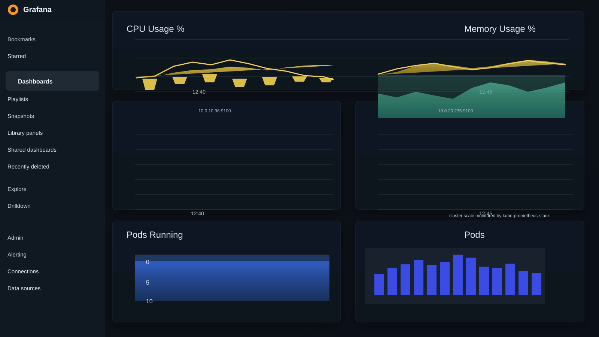

# iac-quality-gate-pipeline

This project automates an end-to-end DevOps workflow on AWS using Terraform, Docker, Kubernetes (EKS), Prometheus, Grafana, and Jenkins. It provisions the infrastructure, populates AWS SSM parameters, bootstraps the EC2 environment, connects to the cluster, deploys the application, and exposes monitoring dashboards.

## Result

The project deployment result is documented in [result.md](result.md), including the live Grafana monitoring dashboard image.



## Overview

The repo includes:

- Terraform modules for VPC, IAM, ECR, EKS, and optional EC2 runner
- AWS SSM parameter publishing for cluster and ECR metadata
- bootstrap scripts to install tooling and connect kubectl to the AWS cluster
- Kubernetes deployment scripts for the app
- Monitoring stack with Prometheus and Grafana
- Jenkins pipeline support for build, quality gate, and deployment

## Required AWS setup

This project is configured for the AWS region `ap-south-1`.

Make sure your EC2 instance is running in the same region and has an IAM role attached.

### Recommended EC2 IAM role

Attach an IAM role with at least the following permissions:

- AmazonEKSClusterPolicy
- AmazonEKSWorkerNodePolicy
- AmazonEKS_CNI_Policy
- AmazonEC2ContainerRegistryReadOnly
- AmazonSSMManagedInstanceCore
- EC2 full access for Terraform most of the time
- EKS full access for Terraform
- SSM access for parameter lookups
- CloudWatch and logs access

After attaching the role, test it:

```bash
aws sts get-caller-identity
aws eks list-clusters --region ap-south-1
```

If the above works, AWS authentication is ready for Terraform and kubectl.

## Required inbound ports

For a fresh EC2 instance, open these inbound ports in the security group:

- 22 → SSH
- 80 → HTTP
- 443 → HTTPS
- 3000 → Grafana (default)
- 3001 / 8081 → Grafana alternative live port
- 8080 → Jenkins
- 9090 → Prometheus (default)
- 9091 → Prometheus alternative live port
- 9093 → Alertmanager

> Do not expose the EKS control plane directly to the internet.

## Install base tools on the EC2 instance

Run the following on a fresh Ubuntu machine:

```bash
sudo apt-get update -y
sudo apt-get install -y \
  curl unzip git jq ca-certificates \
  gnupg lsb-release software-properties-common \
  docker.io

sudo systemctl enable --now docker
sudo usermod -aG docker "$USER"
newgrp docker

# AWS CLI v2
curl "https://awscli.amazonaws.com/awscli-exe-linux-x86_64.zip" -o "awscliv2.zip"
unzip -q awscliv2.zip
sudo ./aws/install
aws --version

# Terraform
wget -O- https://apt.releases.hashicorp.com/gpg | \
  gpg --dearmor | \
  sudo tee /usr/share/keyrings/hashicorp-archive-keyring.gpg > /dev/null

echo "deb [signed-by=/usr/share/keyrings/hashicorp-archive-keyring.gpg] https://apt.releases.hashicorp.com $(lsb_release -cs) main" | \
  sudo tee /etc/apt/sources.list.d/hashicorp.list > /dev/null

sudo apt-get update -y
sudo apt-get install -y terraform
terraform version

# kubectl
curl -LO "https://dl.k8s.io/release/$(curl -L -s https://dl.k8s.io/release/stable.txt)/bin/linux/amd64/kubectl"
chmod +x kubectl
sudo install -o root -g root -m 0755 kubectl /usr/local/bin/kubectl
kubectl version --client

# Helm
curl https://raw.githubusercontent.com/helm/helm/main/scripts/get-helm-3 | bash
helm version

# eksctl
curl --silent --location "https://github.com/weaveworks/eksctl/releases/latest/download/eksctl_$(uname -s)_amd64.tar.gz" | tar xz -C /tmp
sudo mv /tmp/eksctl /usr/local/bin/
eksctl version

export AWS_REGION=ap-south-1
aws configure set region ap-south-1
```

## Optional local Kubernetes practice with Minikube

If you want to practice Kubernetes locally before deploying to EKS, run:

```bash
sudo apt update -y && sudo apt install -y curl conntrack

curl -LO "https://dl.k8s.io/release/$(curl -L -s https://dl.k8s.io/release/stable.txt)/bin/linux/amd64/kubectl"
sudo install -o root -g root -m 0755 kubectl /usr/local/bin/kubectl
kubectl version --client

curl -Lo minikube https://storage.googleapis.com/minikube/releases/latest/minikube-linux-amd64
sudo install minikube /usr/local/bin/minikube
minikube version

sudo apt install -y docker.io
sudo systemctl enable --now docker
sudo usermod -aG docker "$USER"
newgrp docker

minikube start --driver=docker
kubectl get nodes
```

This gives you a local single-node Kubernetes cluster for learning and smoke testing.

## Clone the repo

```bash
cd ~
git clone https://github.com/adityapukhraj1303/iac-quality-gate-pipeline.git
cd iac-quality-gate-pipeline
```

## Terraform setup and automatic cluster creation

The repo is designed to provision infrastructure with Terraform and automatically create the EKS cluster if it does not already exist.

### 1. Initialize and apply Terraform

```bash
cd terraform
terraform init
terraform validate
terraform apply -var-file="environments/dev/terraform.tfvars"
```

This creates or updates:

- VPC
- IAM roles
- ECR repository
- EKS cluster
- node group
- SSM parameters under `/iac-pipeline/dev`

### 2. Verify the SSM parameters

After Terraform apply succeeds, confirm the cluster and repo metadata:

```bash
aws ssm get-parameters-by-path \
  --path "/iac-pipeline/dev" \
  --recursive \
  --query "Parameters[*].[Name,Value]" \
  --output table
```

Expected keys include:

- `/iac-pipeline/dev/cluster_name`
- `/iac-pipeline/dev/cluster_endpoint`
- `/iac-pipeline/dev/ecr_repository_url`
- `/iac-pipeline/dev/vpc_id`
- `/iac-pipeline/dev/grafana_url`

## Bootstrap and project setup

The project bootstrap scripts are designed to do the heavy lifting for you.

### Auto bootstrap flow

Run:

```bash
cd ~
cd iac-quality-gate-pipeline

bash scripts/bootstrap.sh dev
```

What this does:

- checks AWS identity
- installs required tools if missing
- looks for cluster info in AWS SSM
- if the cluster exists, connects kubectl to it
- if the cluster is missing, runs Terraform apply to create infrastructure
- updates kubeconfig for EKS

### Setup monitoring and cluster access

Run:

```bash
bash scripts/setup.sh dev
```

This script will:

- verify AWS identity
- fetch cluster information from SSM or AWS
- connect kubectl to the cluster
- install or repair Prometheus and Grafana
- print the Grafana password and access steps

## Deploy the application

After the cluster is active and kubectl works, deploy the app:

```bash
bash scripts/deploy.sh dev latest
```

This deploys the containerized app into Kubernetes using the cluster metadata from SSM.

## Verify Kubernetes resources

Check cluster health and pods:

```bash
kubectl get nodes
kubectl get pods -A
kubectl get svc -A
kubectl get ingress -A
```

A healthy cluster should show the node in `Ready` state and app pods should be running.

## EKS authentication fix

If you see:

```bash
error: You must be logged in to the server (the server has asked for the client to provide credentials)
```

run:

```bash
aws eks update-kubeconfig --region ap-south-1 --name iac-pipeline-dev-eks
kubectl get nodes
```

If the role is still blocked, map the current AWS principal to the cluster:

```bash
eksctl create iamidentitymapping \
  --cluster iac-pipeline-dev-eks \
  --region ap-south-1 \
  --arn $(aws sts get-caller-identity --query Arn --output text) \
  --username admin \
  --group system:masters
```

Then verify again:

```bash
kubectl get nodes
kubectl get pods -A
```

## Monitoring with Prometheus and Grafana

The repo installs the kube-prometheus-stack via Helm and configures Grafana and Prometheus automatically.

### Check monitoring status

```bash
bash scripts/monitoring.sh status
```

### Show Grafana password

```bash
bash scripts/monitoring.sh password
```

### Run Grafana on a non-default port

The default Grafana port in the stack is 3000 internally, but for easier access from an EC2 instance or browser, use a custom forwarded port:

```bash
kubectl port-forward -n monitoring svc/kube-prometheus-stack-grafana 8081:80
```

Open in browser:

```text
http://<EC2_PUBLIC_IP>:8081
```

Login credentials:

- username: `admin`
- password: from `bash scripts/monitoring.sh password`

### Run Prometheus on a non-default port

```bash
kubectl port-forward -n monitoring svc/kube-prometheus-stack-prometheus 9091:9090
```

Open in browser:

```text
http://<EC2_PUBLIC_IP>:9091
```

### Access through the project script

```bash
bash scripts/monitoring.sh port-forward grafana
bash scripts/monitoring.sh port-forward prometheus
```

This script forwards:

- Grafana → `localhost:3000`
- Prometheus → `localhost:9090`

If you want to expose them on different public ports, use the custom command examples above when tunneling through SSH or a reverse proxy.

## Jenkins setup

Jenkins can be used to run the pipeline after the cluster and repo are in place.

### Required tools on Jenkins agent

Install these on the Jenkins node or agent:

- AWS CLI
- Docker
- kubectl
- Terraform
- Helm
- SonarQube scanner

Ensure the Jenkins machine has AWS credentials via EC2 instance profile or IAM role.

## Full setup in one sequence

For a brand-new EC2 instance, run this sequence:

```bash
sudo apt-get update -y
sudo apt-get install -y \
  curl unzip git jq ca-certificates \
  gnupg lsb-release software-properties-common \
  docker.io

sudo systemctl enable --now docker
sudo usermod -aG docker "$USER"
newgrp docker

curl "https://awscli.amazonaws.com/awscli-exe-linux-x86_64.zip" -o "awscliv2.zip"
unzip -q awscliv2.zip
sudo ./aws/install

wget -O- https://apt.releases.hashicorp.com/gpg | \
  gpg --dearmor | \
  sudo tee /usr/share/keyrings/hashicorp-archive-keyring.gpg > /dev/null

echo "deb [signed-by=/usr/share/keyrings/hashicorp-archive-keyring.gpg] https://apt.releases.hashicorp.com $(lsb_release -cs) main" | \
  sudo tee /etc/apt/sources.list.d/hashicorp.list > /dev/null

sudo apt-get update -y
sudo apt-get install -y terraform

curl -LO "https://dl.k8s.io/release/$(curl -L -s https://dl.k8s.io/release/stable.txt)/bin/linux/amd64/kubectl"
chmod +x kubectl
sudo install -o root -g root -m 0755 kubectl /usr/local/bin/kubectl

curl https://raw.githubusercontent.com/helm/helm/main/scripts/get-helm-3 | bash

curl --silent --location "https://github.com/weaveworks/eksctl/releases/latest/download/eksctl_$(uname -s)_amd64.tar.gz" | tar xz -C /tmp
sudo mv /tmp/eksctl /usr/local/bin/

export AWS_REGION=ap-south-1
aws configure set region ap-south-1
aws sts get-caller-identity

cd ~
git clone https://github.com/adityapukhraj1303/iac-quality-gate-pipeline.git
cd iac-quality-gate-pipeline

bash scripts/bootstrap.sh dev
bash scripts/setup.sh dev
bash scripts/deploy.sh dev latest
```

## Final verification

After deployment, confirm everything works:

```bash
kubectl get nodes
kubectl get pods -A
kubectl get svc -A
bash scripts/monitoring.sh status
```

Then access:

- Application: check the deployed service or ingress
- Grafana: `http://<EC2_PUBLIC_IP>:8081`
- Prometheus: `http://<EC2_PUBLIC_IP>:9091`

## Summary

This repository is designed to work as a real AWS DevOps platform:

- Terraform creates the base cloud infrastructure
- Docker packages the app
- Kubernetes runs the app in EKS
- Prometheus and Grafana provide live monitoring
- Jenkins can orchestrate CI/CD pipelines
- bootstrap and setup scripts automate the process

The key workflow is:

```bash
cd terraform
terraform init
terraform apply -var-file="environments/dev/terraform.tfvars"
cd ..
bash scripts/bootstrap.sh dev
bash scripts/setup.sh dev
bash scripts/deploy.sh dev latest
```

This sequence sets up the cluster, installs monitoring, and deploys the application automatically.
