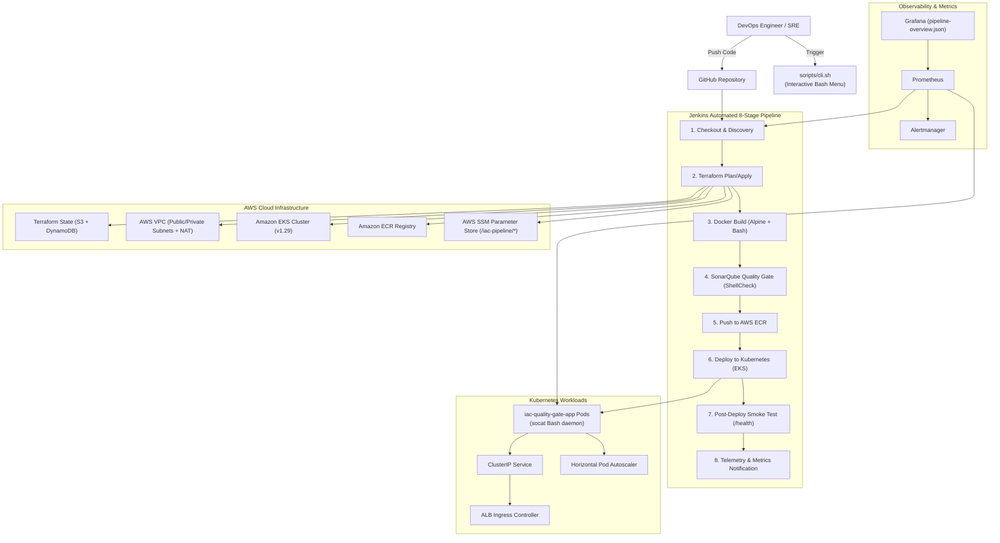

# Architecture Specification

## Overview

The **Infrastructure-as-Code Quality Gate & Auto-Deployment Pipeline** is an enterprise-grade platform built without application frameworks or heavyweight runtimes. It orchestrates infrastructure provisioning, static analysis, containerization, deployment, and monitoring using **strictly Bash, HCL, Groovy, and YAML**.

## Security & Architecture Highlights

1. **Zero Static Credentials**: All nodes, instances, and pipeline runners authenticate using IAM roles and AWS Systems Manager (SSM). No access keys or secrets are stored in Git.
2. **Decoupled State Discovery**: Terraform exports cluster endpoints, ECR URLs, and VPC details directly into AWS SSM Parameter Store. Any instance with an IAM role can run `bootstrap.sh` and immediately interact with the cluster.
3. **Automated Quality Gate Enforcement**: The pipeline executes static ShellCheck rules in SonarQube and triggers `waitForQualityGate abortPipeline: true` to prevent flawed configurations from ever reaching production.
4. **Resilient Rolling Deployments**: Kubernetes deployments enforce active liveness and readiness probes against `/health` with automated rollbacks on smoke test failure.
